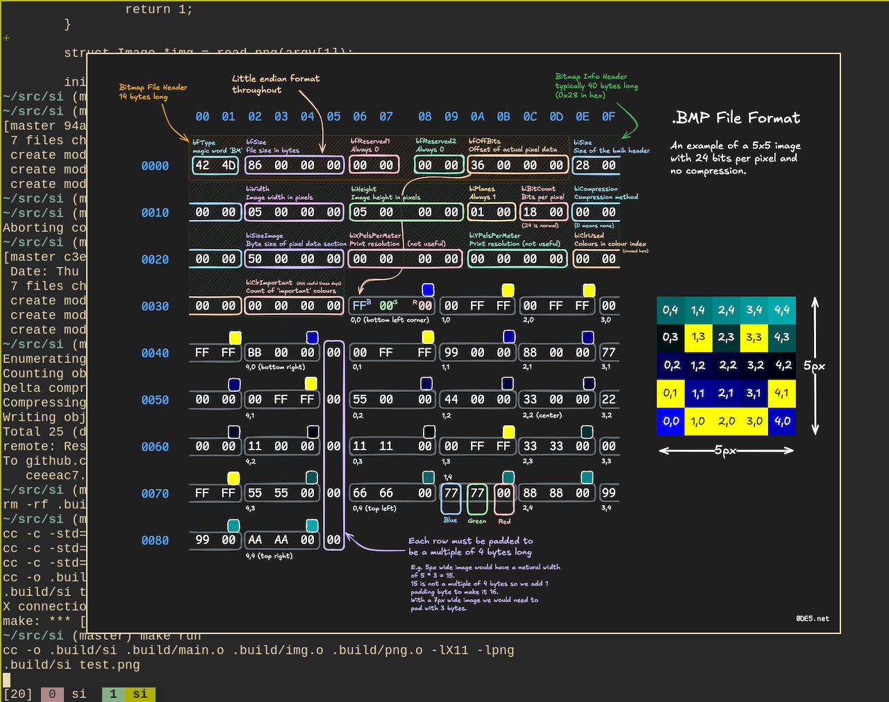

# Si
simple image viewer written in just c and x11


## Dependencies
- libx11
- libpng

## build
```sh
make
```

## usage
```sh
cd .build
./si [file]
```

## TODO
- more filetypes (jpg, bmp, other versions of png, etc)
- better x11 drawing (resizing, moving, etc)
